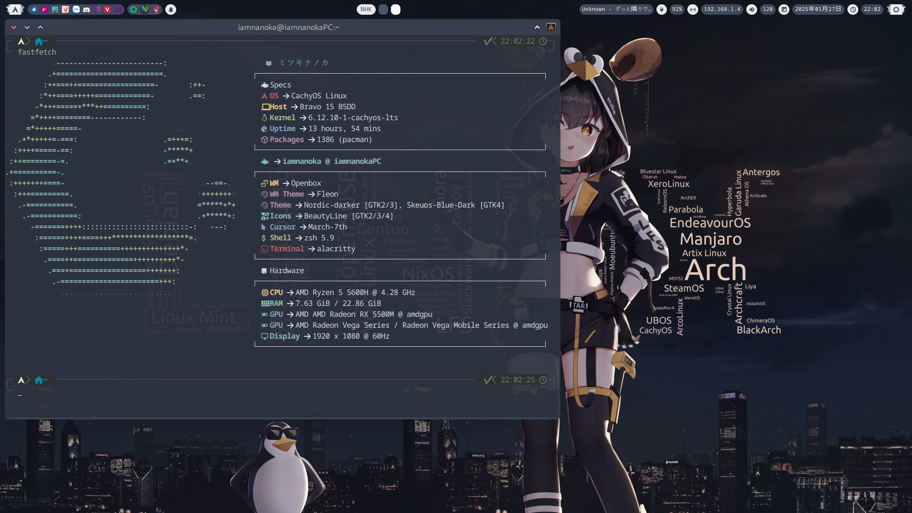

# My peak Openbox dotfiles
This is my personal Openbox configuration. It is a work in progress and will be updated as I continue to tweak it.  
Before you use this configuration, please make sure you have the following packages installed (for example in Arch-based distributions):
```bash
sudo pacman -S openbox betterlockscreen btop dunst fastfetch kvantum-qt5 mpd mpv ncmpcpp obmenu-generator qt5ct rofi thunar tint2 viewnior xfce4-power-manager spectacle nitrogen rxvt-unicode-truecolor-wide-glyphs nm-applet picom perl-gtk3 alsa-utils brightnessctl imagemagick scrot w3m wireless_tools xclip xsettingsd xss-lock thunar-archive-plugin thunar-volman ffmpegthumbnailer tumbler gsimplecal pavucontrol polkit-gnome nvim neovide
```
You should use my neovim configuration for the best experience.  
You can find it [here](https://github.com/nhktmdzhg/nvim).  
## Screenshots

